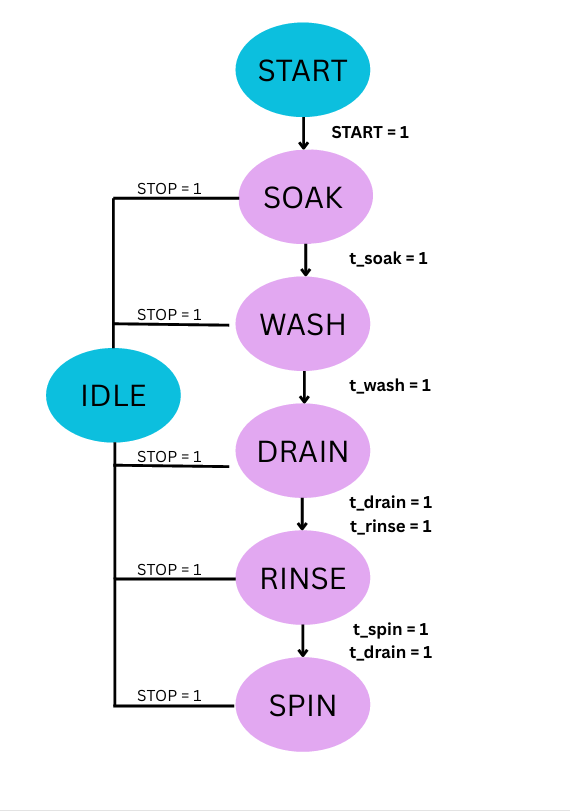
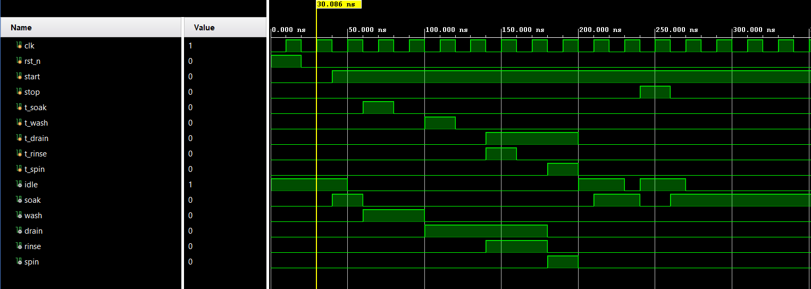

# Washing Machine Controller (Verilog FSM)

A synchronous Finite State Machine (FSM) implemented in Verilog HDL to control the wash cycle of an automated washing machine. The design was developed and verified as part of a semester project at CHARUSAT.

## Overview

The controller sequences the washing machine through six operational states — **IDLE → SOAK → WASH → DRAIN → RINSE → SPIN → IDLE** — with synchronous state transitions driven by a system clock, an asynchronous active-high reset, and a high-priority emergency stop path from any active state back to IDLE.

## FSM States

| State  | Encoding | Output Active | Transition Condition       | Next State |
|--------|----------|----------------|-----------------------------|------------|
| IDLE   | 3'b000   | idle = 1       | start && !stop               | SOAK       |
| SOAK   | 3'b001   | soak = 1       | t_soak                       | WASH       |
| WASH   | 3'b010   | wash = 1       | t_wash                       | DRAIN      |
| DRAIN  | 3'b011   | drain = 1      | t_drain && t_rinse           | RINSE      |
| RINSE  | 3'b100   | rinse, drain = 1 | t_spin && t_drain && !t_rinse | SPIN     |
| SPIN   | 3'b101   | spin = 1       | !t_spin && !t_drain && !t_rinse | IDLE     |

Any non-IDLE state transitions immediately to IDLE if `stop` is asserted.

## State Diagram



## Files

- `Code.md` — FSM controller module (state register + next-state/output logic)
- `Testbench.md` — Verilog testbench simulating a full wash cycle and emergency stop
- `Images/` — State diagram and simulation waveform

## Simulation

The testbench drives a 50 MHz clock (20 ns period) and steps the FSM through a complete wash cycle, then verifies the emergency stop path.



**Verified behavior:**
- Full sequential cycle: IDLE → SOAK → WASH → DRAIN → RINSE → SPIN → IDLE
- Compound transition logic between DRAIN, RINSE, and SPIN
- Emergency stop overrides the cycle from any active state

## How to Use the Code

The files in this repository are provided as templates. To use them in your own projects, you will need to rename the modules to match your file names.

#### Design Code

This is the Verilog code .
```
module Code(
 input  wire clk, 
  input  wire rst_n,     // System Clock Input 
  input  wire start,     // User command to start the wash cycle 
  input  wire stop,
```
**To Use This Code:**
*   Replace `Code` with the name of your Verilog file (e.g., `washing_machine_controller`).

---

#### Testbench Code

This is the testbench used to verify the design code.
```
module test ; 
 
  // DUT inputs 
  reg  clk; 
  reg  rst_n;         // ACTIVE-HIGH async reset (1 = reset) - name kept as rst_n for 
compatibility 
  reg  stop; 
  reg  t_soak; 
  reg  t_wash; 
  reg  t_drain; 
  reg  t_rinse; 
  reg  t_spin; 
 
  // DUT outputs 
  wire idle; 
  wire soak; 
  wire wash; 
  wire drain; 
  wire rinse; 
  wire spin; 
 
  // Instantiate DUT 
  code dut ( 
    .clk   (clk), 
```
**To Use This Testbench:**
1.  Replace `test` with the name of your testbench file (e.g., `testbench`).
2.  On the line `Code dut( clk   (clk)`, replace `Code` with the module name from your design file (e.g., `washing_machine_controller`). This connects the testbench to your gate.

## Future Enhancements

- Replace timer qualifier inputs with real counter/timer modules for time-based control
- Add a 7-segment display decoder for current-state readout
- Add ERROR and PAUSE states for fault handling and mid-cycle pause
- Compare binary vs. one-hot state encoding for power/area trade-offs

## Author

Shreeraj Patil — B.Tech Electronics & Communication Engineering, CHARUSAT
